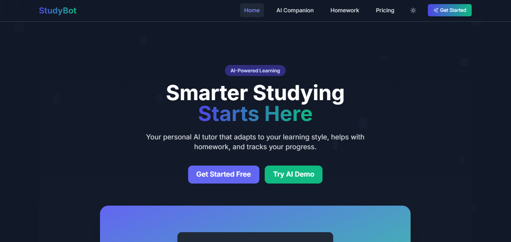
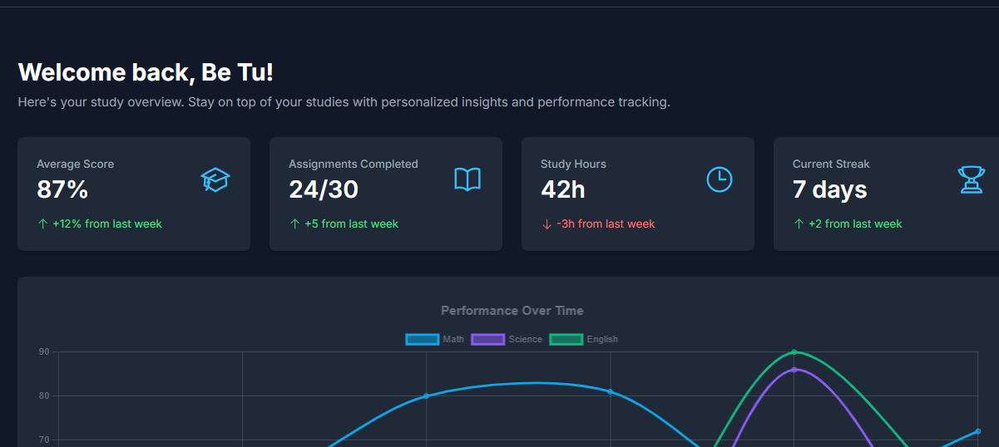
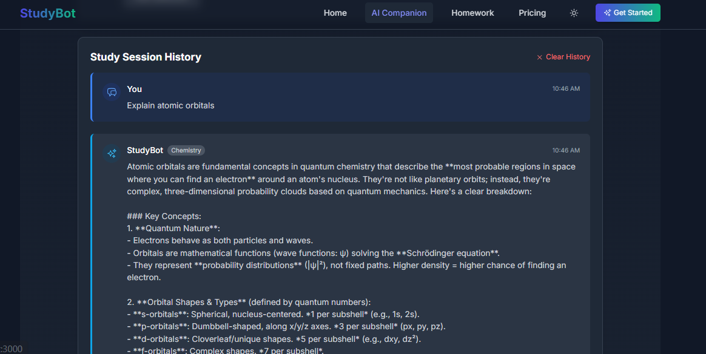

# StudyBot
StudyBot is a mobile-first, AI-powered study assistant designed for university and high school students — and a homework helper for busy parents or working learners. Built with the MERN stack, it offers a sleek and scalable interface with modern animations, graphs, dark/light mode, and a clear CTA-driven experience.

---
Live links👉.
- [**Live Site on Netlify**](https://sensational-eclair-25e9f4.netlify.app/)
- [**Live Site on Render**](https://study-bot-vc9r.onrender.com)
---
### 📸 Screenshots
#### 🏠 Home Page


#### 📊 Dashboard


#### 🤖 AI Chat Assistant


## 🚀 Features
- 🎓 AI Homework Assistant (Coming soon)
- 🧠 Student Performance Dashboard.
- 📱 Mobile-first responsive design
- 🔐 Authentication-ready
- 📊 Chart.js for progress tracking

---

## 🏗️ Tech Stack

| Layer       | Tech                        |
|------------|-----------------------------|
| Frontend    | React, Tailwind CSS, Framer Motion, React Router |
| Animations  | Framer Motion, React Confetti |
| Charts      | Chart.js (via `react-chartjs-2`) |
| Notifications | `react-hot-toast`          |
| Backend     | Node.js, Express (planned) |
| Auth        | JWT / Auth Provider (planned) |

---

## ⚙️ Setup Instructions
### 1. Clone the repo

```bash
git clone https://github.com/bethwel3001/PLPHack-2
cd studybot-frontend
```
### 2. Install dependencies
```bash
npm install
```
### 3. Taiwind css setup
```bash
npx tailwindcss init -p
```
### 4. Start the dev server
```bash
npm start
```

## 🧪 Development Notes
*Tailwind Version:* 3.4.1 (for full compatibility with Create React App)

*Chart Support:* via react-chartjs-2

*Dark Mode: uses Tailwind's darkMode:* 'class' system

*Toast Notifications:* powered by react-hot-toast

## 🔜 Upcoming Features
- AI-powered Q&A using OpenAI

- Course selection and personalized tips

- Backend API for quiz and study data

- Auth system with token storage

- Task reminders and streaks


### 🙌 Built With ❤️ By Be Tu

- [Bethwel Kiplagat](https://github.com/bethwel3001)

### 📄 License

This project is licensed under the MIT License.
# 🤝 Contribution Guide

Thank you for considering contributing to StudyBot! We welcome all forms of contributions from the community.

## 🛠️ Getting Started

### Prerequisites
- Node.js 18+
- npm 9+
- Git

### Setup
1. Fork the repository
2. Clone your fork:
   ```bash
   git clone https://github.com/your-username/studybot.git
   cd studybot
   ```
3. Instal dependenciies
   ```
   npm install
   ```
4. Create a .env file based on .env.example

### Development Workflow
- Branch Naming
Use this format: [type]/[short-description]
Example: feat/add-dark-mode

- Commit Messages
Follow Conventional Commits:

text
<type>(<scope>): <description>
Types:
feat: New features
fix: Bug fixes
docs: Documentation changes
style: Code style/formatting
refactor: Code changes that neither fixes a bug nor adds a feature
test: Adding missing tests
chore: Maintenance tasks

### Reporting Issues
When opening an issue, please include:

Clear description of the problem
Steps to reproduce
Expected vs actual behavior
Screenshots if applicable
Device/browser information

### Pull Requests
Keep PRs focused on a single feature/fix
Reference related issues
Include relevant tests
Update documentation if needed
Ensure all tests pass

### Versioning
We follow Semantic Versioning (SemVer)

💬 Code of Conduct
Please note we have a Code of Conduct. Please follow it in all your interactions with the project.

### Acknowledgments
Thank you to all our contributors

Special thanks to OpenRouter for their API support